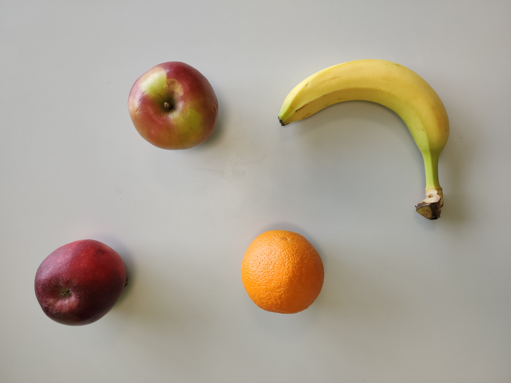

# Fruit++

### Description

This script allows the user to easily count the number of fruits in the images provided at the input and then presents the results as a JSON file. Currently, the script can detect the following 3 types of fruits:

- apples

- bananas

- oranges


### Libraries

- [OpenCV](https://docs.opencv.org/master/)
- [NumPy](https://numpy.org/)
- [Click](https://palletsprojects.com/p/click/)
- [tgdm](https://tqdm.github.io/)


### Script call

Script `detect_fruits.py` takes 2 input parameters:
- `data_path` - path to the folder with data (photos)
- `output_file_path` - path to the file with the results

```bash
$ python3 detect_fruits.py --help

Options:
  -p, --data_path TEXT         Path to data directory
  -o, --output_file_path TEXT  Path to output file
  --help                       Show this message and exit.
```

In the Linux console, the script can be called from the project directory as follows:

```bash
python3 detect_fruits.py -p ./data -o ./results.json
```


### Output

The detection results are outputted into a JSON file for all images in the catalog.

<p align="center">
  
</p>

```JSON
{
  ...,
  "07.jpg": {
    "apple": 2,
    "banana": 1,
    "orange": 1
  },
  ...
}
```
